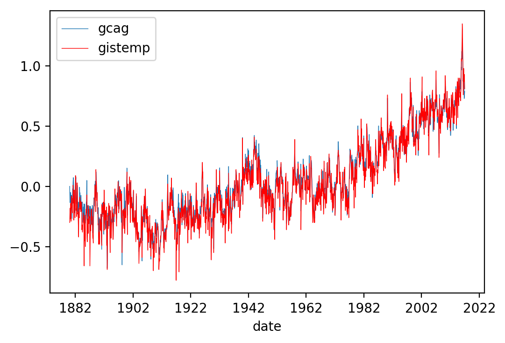
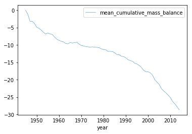
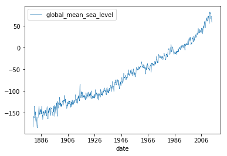
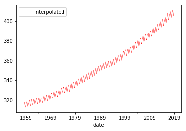
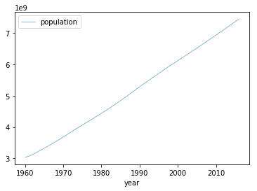
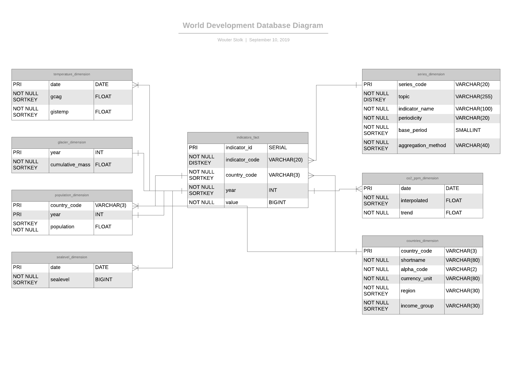

# World Development Analysis
Apache Airflow data pipelines to collect and process data about world development and climate change.

## Goal of the project
This project has been initiated to finalise the Udacity Nanodegree of Data Engineering.
Goal of the project is to build data pipelines for retrieving and processing 
data about world development and it's correlation to climate change.

## Planning
1. Gather data sources
2. Setup development environment
3. Analyse data sources using Jupyter Notebooks
4. Define data model
5. Build Airflow operators and plugins
6. Build data pipelines
7. Validate results

### 1. Data sources
Most data packages are retrieved from [Datahub.io](https://datahub.io) 
using the Python package [datapackage](https://github.com/frictionlessdata/datapackage-py).

The world development indicators data package has been retrieved from [Kaggle.com](https://kaggle.com).

The following data packages have been used for this project:
* [Global Temperature Time Series](https://datahub.io/core/global-temp)
* [Glacier Mass Balance](https://datahub.io/core/glacier-mass-balance)
* [Sea Level Rise](https://datahub.io/core/sea-level-rise)
* [CO2 PPM - Trends in Atmospheric Carbon Dioxide](https://datahub.io/core/co2-ppm)
* [World Population Growth](https://datahub.io/core/population) 
* [World Development Indicators](https://www.kaggle.com/worldbank/world-development-indicators)

### 2. Development environment
The development environment is build on top of Docker for easier deployment. 
It uses a stripped down version of the 
[Puckel Airflow docker image](https://github.com/puckel/docker-airflow) 
as a starting point. This includes the following containers:
* Postgres database
* Redis as a message broker
* Airflow scheduler
* Airflow webserver
* Airflow worker

### 3. Dataset analysis
Each data set will be analysed individually using Jupyter Notebooks. 
All notebooks can be found in the `/notebooks` folder.

#### 3.1 Global temperature time series
The data package contains datasets for the temperature deviations between 1882 and 2016.
There are two datasets available: the yearly temperature deviation and the 
monthly temperature deviation. 

Information about dataset:
* 3 columns
* 3288 rows
* Format: CSV

Interesting columns are:
* Date
* GCAG (combined dataset for global temperature anomaly data from GHCN and ICOADS)
* GISTEMP (combined land-surface air and sea-surface water temperature anomalies from NASA's GISS)

After analysis, we see that the global temperature has roughly increased with one degree Celsius since the global mean of 1951 to 1980:

#### 3.2 Glacier mass balance time series
The data package contains a dataset with the average cumulative mass balance of Glaciers worldwide from 1945 - 2014.
1945 is the base year for the dataset. Measurements are in meters of water. This represents the global changes
in the average thickness of glaciers.

Information about dataset:
* 3 columns
* 70 rows
* Format: CSV

Interesting columns are:
* Year
* Mean cumulative mass balance

The data clearly shows a massive decrease of roughly 30 meters since 1945 in the average thickness of glaciers worldwide:

#### 3.3 Sea level rise
The data package contains a dataset with the global mean of the sea level from 1886 to 2015.
The base year of the dataset lies around 1986.

Information about dataset:
* 3 columns
* 1608 rows
* Format: CSV

Interesting columns are:
* Date
* Global mean sea level (millimeters)

The data shows an increase of almost 60 millimeters since the base year of 1985.
When comparing it to the start of measurements (1886), the sea level has increased with more than 210 millimeters.

#### 3.4 CO2 PPM 
The data package contains a dataset with the trend of carbon dioxide PPM since 1958.
The carbon dioxide PPM is defined as the number of CO2 molecules divided by all molecules in the air
after water vapor has been removed.
 
Information about dataset:
* 6 columns
* 727 rows
* Format: CSV

Interesting columns are:
* Date
* Interpolated (CO2 PPM)
* Trend

The data shows an increase of almost 100 PPM of CO2 (300 PPM to 400 PPM) in the air since 
the base year of 1959.

#### 3.5 Population growth 
The data package contains a dataset with the population growth per country, per region, per continent and globally.
 
Information about dataset:
* 4 columns
* 14885 rows
* Format: CSV

Interesting columns are:
* Country name
* Country code
* Year
* Population

The data shows an increase of over 4 billion people since the base year of 1960. That is an increase of more than 200%.

#### 3.6 World Development Indicators
The data package contains 6 datasets, available as seperate CSV's or packaged in a SQLite database. 
We will use the CSV's for ease of use. The package consists of the following datasets:

1. Country
2. CountryNotes
3. Footnotes
4. Indicators
5. Series
6. SeriesNotes 

We will focus on three of the six datasets: country, indicators and series.

##### 3.6.1 Country

The country dataset contains 247 rows and 31 columns. The interesting columns are:

* CountryCode
* ShortName
* Alpha2Code
* CurrencyUnit
* Region
* IncomeGroup

##### 3.6.2 Indicators

The indicators dataset contains 6 columns and roughly 5.660.000 rows. The interesting columns are:

* CountryCode
* IndicatorCode
* Year
* Value

##### 3.6.3 Series

The series dataset contains information about the indicators. It consists of 20 columns and 1345 rows. 
Interesting columns are:

* SeriesCode
* Topic
* IndicatorName
* Periodicity
* BasePeriod
* AggregationMethod

The UnitOfMeasure column would have been a good addition to the above mentioned columns, however, 
it rarely has a value and is therefore left out.

### 4. Data Model

The indicator dataset has been chosen as the fact table. The other datasets are used as dimension tables. 
Most relations between the fact and dimension tables are based on date or country code.

### 5. Data pipelines
The data pipelines have a number of goals:
* Retrieving data out of sources:
    * API's
    * [Datahub.io](https://datahub.io)
* Storing the data to a data lake (AWS S3)
* Copy data from the data lake to staging tables in the data warehouse (AWS Redshift)
* Insert data from the staging tables to fact and dimension tables
* Validate data quality